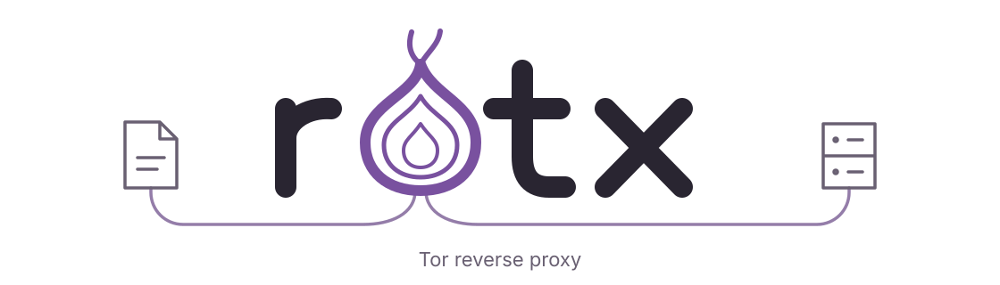

<picture>
	<source media="(prefers-color-scheme: dark)" srcset=".github/banner.svg">
	<source media="(prefers-color-scheme: light)" srcset=".github/banner-light.svg">
	
</picture>

rotx is a lightweight Tor reverse proxy and static file server, designed for high performance and zero-allocation routing. It sits between Tor and local files or HTTP services, serving multiple onion addresses with separate routes for each.

The configuration is nginx-style, with a smaller set of features and some intentional differences in behavior. The name comes from *tor* backwards (*rot*) and the *x* in *nginx*.

## Documentation

- [Running](#running)
- [Configuration](#configuration)
- [Config syntax](#config-syntax)
- [Onion defenses and authorization](#onion-defenses-and-authorization)
- [Routing](#routing)
- [Static files](#static-files)
- [Reverse proxy](#reverse-proxy)
- [Responses and headers](#responses-and-headers)
- [Caching](#caching)
- [Compression](#compression)
- [Development](#development)

## Running

Run `rotx version` to print the release version and an indented list of native library versions. This command does not load configuration or start Tor. Tor/OpenSSL/Libevent/zlib versions come from the linked libraries' version APIs.

Start `rotx` from the directory containing `rotx.conf`. It runs embedded Tor, keeps Tor's persistent state in `data/tor`, waits for bootstrap and registers every configured onion identity on HTTP port 80. The identity files are revalidated at registration and both native Tor keys and PEM keys are supported.

All onion services share one dynamically assigned IPv4 loopback listener. Tor forwards streams directly to that listener without an intermediate HTTP proxy. Routing uses the original onion `Host` header. Plain's access-log middleware records the method, path, status, duration and requested host after each completed request. The host identifies the requested onion service, not the visitor's IP. HTTP handling and access logging are not allocation-free.

Registration is not a reachability check: Tor still needs introduction circuits and successful descriptor uploads before clients can find the service. The startup log reports registration rather than claiming publication. Failures before HTTP reaches rotx, including descriptor lookup failures, produce no HTTP access log. Configuration is loaded once at startup; changes require a restart.

rotx listens for Tor's descriptor events continuously, including while no control commands are running. It logs the first descriptor creation, upload attempt and confirmed publication for each onion service per process. Publication means one hidden-service directory (HSDir) accepted the descriptor; remaining replicas and client reachability may still take time. Repeated successful uploads are condensed, while upload failures include Tor's reason and the HSDir involved. If startup stops at registration or descriptor creation, no upload has yet been confirmed.

Tor console logs use Plain's timestamp and the format `[tor/level] message`, with only the level colored using the logger's theme. The native callback provides the severity and timestamp-free message directly.

Ctrl+C or SIGTERM stops accepting requests, allows active responses up to 30 seconds to finish and then shuts down Tor and removes its onion registrations. Startup failures and unexpected Tor or listener exits also clean up the listener and Tor instance.

## Configuration

The executable reads `rotx.conf` from the working directory. The file uses the syntax below, regardless of its extension.

```nginx
http {
	header_set X-Content-Type-Options nosniff;

	server {
		name "<onion-name-without-.onion>";

		key_private keys/hs_ed25519_secret_key;
		key_public keys/hs_ed25519_public_key;

		root public;
		index index.html;

		location /api/ {
			proxy_pass http://127.0.0.1:8080;
		}

		location ^~ /assets/ {
			alias assets;
			cache 30d;
		}

		location = /health {
			header_set Content-Type text/plain;
			return 200 "ok\n";
		}
	}
}
```

Replace the placeholder with the lowercase, 56-character v3 onion name matching the key files. Each address gets its own `server` block inside `http`.

| Directive | Scope | Meaning |
| --- | --- | --- |
| `name value` | server | Onion name without `.onion`. |
| `key_private path` | server | Private identity key. |
| `key_public path` | server | Public identity key. |

All three are required. rotx validates the onion checksum and checks that the name and keys agree. Keys may use Tor's native Ed25519 format or unencrypted Ed25519 PEM files (PKCS#8 private and PKIX public).

## Config syntax

- Directives end with `;`. Blocks use `{ ... }`. Comments start with `#`.
- Arguments may be unquoted, single-quoted or double-quoted. Quote values containing whitespace or syntax characters; regular expressions must be quoted.
- Exactly one `http` block contains one or more `server` blocks. Locations belong directly to a server and cannot be nested.
- `include path-or-glob;` inserts configuration at that point. Glob matches are loaded in sorted order.
- Relative file paths resolve against the file containing the directive, including inside included files.
- Unknown or misplaced directives, duplicate singleton directives and conflicting handlers are errors. Diagnostics include the source file, line and column.

Locations inherit their server's settings, never another location's. A `root`, `alias`, `proxy_pass` or `return` directive replaces the inherited handler; only one of these may appear in a block.

## Onion defenses and authorization

| Directive | Scope | Behavior |
| --- | --- | --- |
| `pow on/off` | http | Enable Tor v3 proof-of-work defenses for every onion service. Default: `off`. |
| `client_key path` | server | Load one authorized client's public key. Repeatable. |
| `client_keys directory` | server | Load immediate `*.auth` files from a directory, without recursion. Repeatable. |

Native builds always include Tor's PoW module. Enabling `pow` fails startup if the linked library lacks support or Tor rejects the service configuration.

Client key files contain `descriptor:x25519:<52-character base32 public key>`. Both client directives combine into one deduplicated authorization list. Paths resolve relative to the declaring configuration file. Only public keys belong on the server; clients retain their corresponding private authorization keys. An unreadable or invalid key, missing directory or explicitly configured directory without any `*.auth` files is a configuration error. Authorization is validated and loaded once; changing keys requires a restart. Without either directive the onion service is public.

## Routing

The request's `.onion` host selects the server. Location matching then uses the decoded path, with repeated slashes and dot segments normalized and the query string excluded.

| Location | Match |
| --- | --- |
| `location = /path` | Exact path. |
| `location /path` | Path prefix. |
| `location ^~ /path` | Path prefix that skips regex matching if it is the longest matching prefix. |
| `location ~ "pattern"` | Case-sensitive Go regular expression. |

Exact matches win. Otherwise, rotx finds the longest prefix. Unless that prefix uses `^~`, regex locations are checked in declaration order and the first match wins. With no regex match, rotx uses the longest prefix, then the server's handler, then 404. Unknown hosts also return 404.

Prefixes are textual: `/foo` matches `/foobar` as well as `/foo/bar`.

## Static files

| Directive | Scope | Behavior |
| --- | --- | --- |
| `root path` | server/location | Append the entire request path to the root. |
| `alias path` | server/location | In a prefix location, replace the matched prefix with this path. In an exact location, use the target directly. At server scope, append the entire request path. Explicit regex aliases are not supported. |
| `index name ...` | server/location | Try index files in order; replaces the inherited list. Default: `index.html`. |

Static serving supports GET and HEAD, MIME detection, byte ranges and conditional requests. Directory URLs redirect to a trailing slash; directories without an index return 404. There are no directory listings. File access is confined to the configured root or alias boundary, including symlink resolution.

Configured roots and aliases are checked while loading configuration, before Tor starts. Roots and non-exact aliases must be accessible directories; an exact alias may name an accessible regular file or directory. Invalid targets report the directive's source position and resolved filesystem path. Individual requested files and index candidates need not exist at startup; missing files, missing indexes and paths removed after startup return 404.

## Reverse proxy

| Directive | Scope | Behavior |
| --- | --- | --- |
| `proxy_pass URL` | location | HTTP(S) upstream, optionally with a base path. Credentials, query strings and fragments are not accepted. |
| `proxy_path /path` | location | Replace the entire outgoing path, including any upstream base path. |
| `proxy_buffer on/off` | location | Buffer the full response body in memory instead of streaming. Default: `off`. |
| `proxy_compress on/off` | location | Apply the configured compression algorithms to eligible upstream responses. Default: `off`. |

All `proxy_` directives are location-only; `proxy_path`, `proxy_buffer` and `proxy_compress` require `proxy_pass`. Request query strings are preserved.

`proxy_compress on` streams compression with bounded encoder working memory and propagates flushes. Adding `proxy_buffer on` buffers the entire original upstream body first, then compresses it when sending the response. Already encoded responses pass through unchanged. Partial responses, bodyless statuses, `text/event-stream` and requests or responses with `Cache-Control: no-transform` bypass compression. Transformed responses lose the original content length and integrity digests; strong upstream ETags become weak. Proxy response bodies are never stored in the compression cache.

Unlike nginx's prefix-replacement behavior, `proxy_pass` joins its base path with the **entire** request path. For example, `/api/users` with `proxy_pass http://127.0.0.1:8080/base;` becomes `/base/api/users`.

The proxy reuses upstream connections and forwards methods, bodies, status codes and end-to-end headers. The upstream `Host` comes from `proxy_pass`; `X-Forwarded-Host` and `X-Forwarded-Proto` describe the incoming request. Incoming `Forwarded`, `X-Forwarded-For` and `X-Real-IP` are removed and transport peer addresses are not forwarded. CONNECT and protocol upgrades return 501.

## Responses and headers

| Directive | Scope | Behavior |
| --- | --- | --- |
| `return status [body]` | location | Send a standard final HTTP status with a literal body or the status text if omitted. Must be last in the location. |
| `header_set name value` | http/server/location | Replace all response header values. |
| `header_add name value` | http/server/location | Append a response header value. |
| `header_unset name` | http/server/location | Remove a response header. |
| `server_tokens auto/off/full/keep` | http/server/location | Control the `Server` header. Default: `auto`. |

`server_tokens auto` sets `Server: rotx`; `full` sets `Server: rotx/v<version>` (or `rotx/dev` for development builds). `off` removes the header, including upstream values. `keep` preserves an existing upstream value and adds nothing when absent. This policy inherits from HTTP to server to location.

Header operations run in declaration order, from `http` to `server` to `location`, after cache processing and the server-token policy. `header_unset Server` and `header_set Server custom` therefore override that policy. These rules also apply to generated error responses. Connection and framing headers are reserved for the transport. Statuses 204, 205 and 304 cannot have an explicit body.

## Caching

`cache` sets response cache policy at server or location scope. It does not store upstream responses.

| Value | Behavior |
| --- | --- |
| `auto` | Leave cache headers untouched. Default; overrides any inherited policy. |
| `off` | Set `Cache-Control: no-store`. |
| `on` | Set `Cache-Control: public, max-age=3600`. |
| `30d`, `12h`, `5m`, `30s` | Set a public max-age using a positive integer and one unit. |

Enabled static caching adds `Last-Modified` and a weak ETag from file metadata for uncompressed files. Compressed static representations supply their own validators. Matching conditional GET/HEAD requests return 304. Proxy validation is left to the upstream. Header directives can override or remove cache headers.

## Compression

| Directive | Scope | Behavior |
| --- | --- | --- |
| `compress zstd gzip brotli` | http/server/location | Enable the listed algorithms in preference order. Default: `off`; `compress off` resets inheritance. |
| `compress_cache off/file/memory` | http/server/location | Cache dynamically compressed static files. Default: `off`. |
| `compress_memory_limit size` | http | Shared memory-cache byte limit. Default: `32M`; accepts bytes or positive `K`, `M`, `G` binary units. |

Compression settings inherit from HTTP to server to location. Negotiation honors `Accept-Encoding` quality values and exclusions; directive order breaks equal-quality ties. `brotli` uses the standard `br` response token. An absent header selects the original representation. Requests rejecting every available representation receive 406. Proxy routes require explicit `proxy_compress on`; `compress off` still disables their compression.

For static files, rotx chooses the encoding first, then looks for a companion file: `.gz`, `.zst` (then `.zstd`) or `.br`. A lower-priority companion never displaces the preferred encoding. If no matching companion exists, rotx compresses the original. Companions stay inside the configured filesystem boundary and should be updated alongside their original files. Responses retain the original file's MIME type and include `Vary: Accept-Encoding`. HEAD, conditional requests and single byte ranges operate on the selected encoded representation, with representation-specific ETags. Multi-range requests receive the complete encoded representation. `Cache-Control: no-transform` requests select the original representation.

With `compress_cache off`, dynamic representations are regenerated into temporary files on each request and removed afterward; this bounds working memory and permits encoded byte ranges. `memory` keeps an LRU shared by all routes. Its limit counts retained compressed data only: active readers, transient results and encoder working memory are additional. Entries larger than the limit are served without retention. `file` stores content-SHA256-named variants such as `<hash>.br` in `./data/cache/compress`, plus atomic metadata records mapping source paths, sizes and modification times to hashes. Unchanged sources are served without rereading or rehashing their contents. Metadata changes trigger regeneration; deployments must update file size or modification time when changing contents. Same-source generation is coordinated across concurrent requests.

The disk cache persists across restarts and has no automatic size limit or eviction. Remove stale cache files manually when needed. The `cache` directive controls HTTP caching headers independently of `compress_cache`.

## Development

Use the Go version declared in [go.mod](go.mod). The executable requires CGO and the bundled Tor native archive for its target. Supported targets are Windows and Linux on amd64 and arm64.

`tools/tor/build.sh` rebuilds the native archives with Zig 0.17.0 and Tor's GPL PoW module and applies `tools/tor/logging.patch`. This small patch attaches the host callback to Tor's console handlers, including handlers replaced during log reconfiguration. Normal file logging and signal-safe diagnostics retain their original destinations.

```sh
go build .
go test ./...
```

`pkg/config` loads and validates configuration and then compiles the routing table. `pkg/config/syntax` handles parsing and includes. `pkg/router` provides the HTTP handler, static file serving and reverse proxy. `pkg/server` owns the listener, onion registration and shutdown lifecycle; `pkg/tor` embeds and controls Tor.
